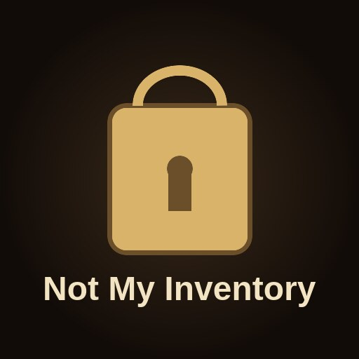

# Not My Inventory

An [Elin](https://store.steampowered.com/app/2135150/Elin/) mod that keeps everything you carry safe. Nothing in your inventory can be stolen, and nothing in it can be destroyed or ruined by hostile damage.



## Features

You get the innate passive **Inventory Ward**, listed on your character sheet under *Feats → Innate Feats*. Whenever it protects you, the message log says so:

```
Gnome tried to steal from you, but it was negated. Theft prevented by Inventory Ward.
[Incoming Damage] Fire - inventory damage negated by Inventory Ward.
```

| Protection | What it blocks |
|---|---|
| **Theft** | Steal abilities (items, food, gold) used by gnomes, thieves and others; pickpocketing; rogues skimming gold when you swap places; bandits on the road demanding an item |
| **Fire & cold** | Burning, shattering or cooking of anything you carry, including items inside containers. Your fireproof and coldproof blankets are no longer used up |
| **Acid** | Corrosion of your equipment (loss of its enchantment level) |
| **Curses** | Hostile curses that would curse or doom your equipment |

Only the player's inventory is protected. Anything you do yourself, like selling, dropping, giving or eating, works as normal.

## Configuration

After the first launch, edit `Elin/BepInEx/config/jajohn7m.notmyinventory.cfg`:

```ini
[Protection]
PreventTheft = true
PreventElementalDestruction = true
PreventAcid = true
PreventCurse = true

[Display]
PassiveName = Inventory Ward
```

Restart the game after you change anything.

## Installation

- **Steam Workshop:** subscribe to the mod and enable it in Elin's **Mods** menu.
- **Manual:** copy the built mod folder to `Elin/Package/Mod_NotMyInventory/`.

It is safe to remove the mod at any time. When it's gone, the game drops the passive from your save.

## Building from source

Requirements: the [.NET SDK](https://dotnet.microsoft.com/download) (10.0 or later) and an Elin install. Elin comes with BepInEx built in.

1. Point the build at your game by setting the `ElinGamePath` environment variable to your Elin folder, or edit the default in `Directory.Build.props`.
2. Build and deploy:
   ```bash
   ./deploy.sh            # Debug build
   ./deploy.sh Release    # Release build
   ```
   The script checks that Elin is closed, builds straight into `Elin/Package/Mod_NotMyInventory/` and confirms that the files were updated. On Windows, run `dotnet build -c Release` instead.
3. Launch Elin. The BepInEx log (`Elin/BepInEx/LogOutput.log`) should contain `Not My Inventory 1.0.0 loaded`.

### Project layout

| Path | Purpose |
|---|---|
| `Plugin.cs` | BepInEx entry point and config |
| `InventoryWard.cs` | Registers the Inventory Ward passive and grants it to the player |
| `Notify.cs` | Writes the mod's messages to the in-game log |
| `Protection.cs` | Decides what counts as "the player's inventory" |
| `Patches/` | Harmony patches for theft, hostile effects and item damage |
| `package/` | `package.xml` and `preview.jpg`, copied into the mod folder on build |

The project is based on the [Elin Plugin Template](https://github.com/gottyduke/Elin.Plugins/tree/master/PluginTemplate) and the [Elin Modding Wiki](https://elin-modding-resources.github.io/Elin.Docs/).

## Bug reports & feedback

Please report problems through **Steam**: leave a comment on the mod's Workshop page, or message me on my [Steam profile](https://steamcommunity.com/profiles/76561198818272804). If you can, include the relevant part of `Elin/BepInEx/LogOutput.log`.

## Credits

Created by **jajohn7m**: [Steam profile](https://steamcommunity.com/profiles/76561198818272804) · [GitHub](https://github.com/jajohn7m-source)

## License

[MIT](LICENSE)
